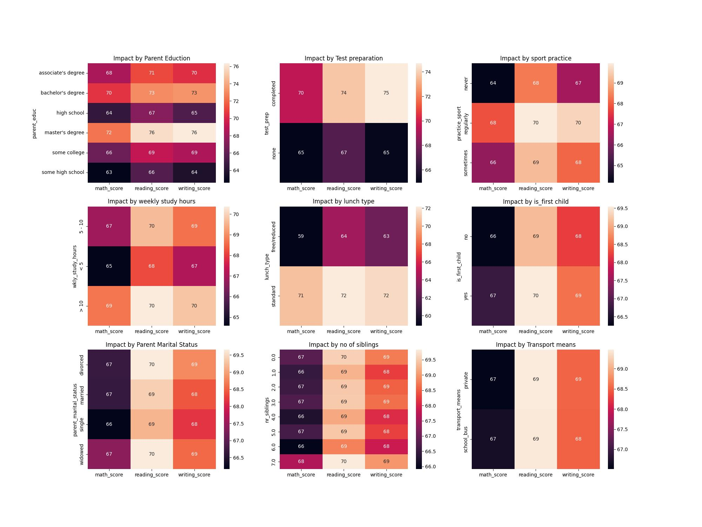

# Student_Score_analysis
# Steps
1. Dataset was downloaded for the kaggle with the kaggle API usage.
2. Correct the Column names.
3. Drop Unnamaed Column.
4. Change weekly_study_hours column
5. Analysis
    1. Gender Destribution
    2. Impact by Parent Eduction
    3. Impact by Parent Marital Status
    4. Impact by Test preparation
    5. Impact by Weekly Study Hours
    6. Impact by sport practice
    7. Impact by Transport means
    8. Impact by no of sibilings
    9. Impact of lunch type
    10. impact of first child or not
6. Distribution of the ethnic groups.
7. Insights

1. For the first step the kaggle was installed in the python envirnment then the API token was generated and which was used to directly downlod the data set into the system.
2. The column names were corrected by the re package in which for every second instance of captial letter the "_" was added, and column names were converted to lower case.
3. later the unnamed column was dropped by using the drop command.
4.  As there is no anamoly their no need to change the wkly hours
5.  individual analysis was performed on each factors.
6.  insights were drawn.

# Insights
1. From the a bove chart we can conclude that the eduction of the parents has a good impact on the student scores.
2. So from the above chart we can say parent_marital_status does not have any impact on student scores
3. The students who were prepared for the exams were scored higher than the students who are not.
4. This shows that the students who practice sports daily were the ones with the highest avg scores.
5. This shows that the number of weekly study hours does have the impact on the scores of the students were the > 10 hours had highest average scores in the subjects.
6. this shows that the mode of transport does not impact the scores.
7. These show that the sibilings number does not impact the scores.
8. Their is a clear difference in scores the students who get the standard food and who are not and the difference is significant.
9. No impact is their in the score by whether he is a first child or not.
  
